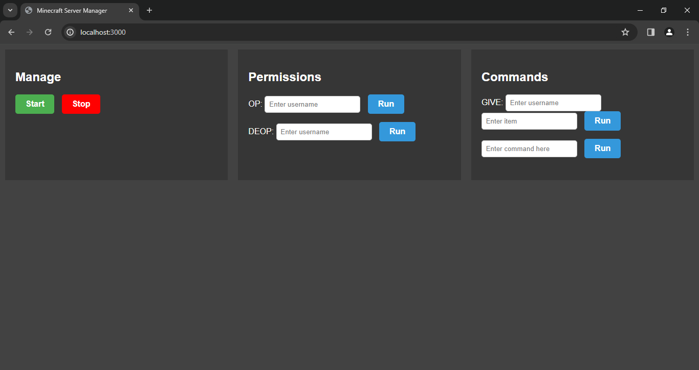

# Minecraft Bedrock Server GUI

This project provides a simple web-based GUI for managing a Minecraft Bedrock server. Users can manage and send commands to the server using the provided interface.


## Prerequisites

Before running this project, ensure you have the following installed:

- [Node.js](https://nodejs.org/)
- [Bedrock Dedicated server](https://www.minecraft.net/en-us/download/server/bedrock) place it in the ```server``` folder at the root of the project

## Installation

1. Clone this repository:

   - Clone the repository:

     ```git clone https://github.com/whyisthesheep/mcb-gui.git```

2. Navigate to the project directory:

   - Navigate to the project directory:

     ```cd mcb-gui```

3. Install dependencies:

   - Install dependencies:

     ```npm install```

4. Place your Minecraft Bedrock server files in the ```server``` folder at the root of the project:

   - Install Minecraft bedrock:
      - Automatic:
         - Run ```install.bat```

      - Manual:
         - Download [Bedrock Dedicated server](https://www.minecraft.net/en-us/download/server/bedrock)
         - ```mkdir server```
         - Move the contents of Bedrock Dedicated Server to ```server```
   
## Usage
How to start:
   - Running ```start.bat``` will start the project and open it in the browser.
       - Running ```node app.js``` and opening [localhost:3000](http://localhost:3000) will do the same thing.

## Customization

- **Changing Port:** If you want to use a different port, modify the ```port``` variable in ```app.js```.

## Future
- [x] Windows
- [x] Windows install script
- [ ] Linux (should work the same in theory but the bedrock server executable is  a `.exe` in `app.js` rather than `.sh` and also an environment variable is required in the command; I will probably add linux support soon.)
- [ ] Linux install script
- [ ] Modular website design
- [ ] Console on GUI
- [ ] Player list/Manager
- [ ] Settings menu
- [ ] Themes
- [ ] World manager

## Contributing

Feel free to contribute by opening issues or submitting pull requests. Your feedback and contributions are welcome! Please make prs to the dev branch unless it is a simple change.

## License

This project is licensed under the [Mozilla Public License v2](LICENSE).
